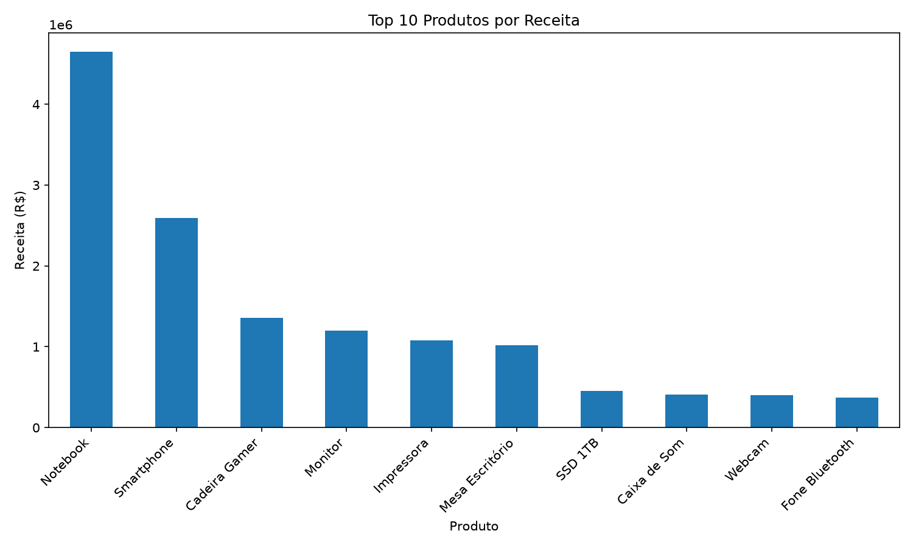
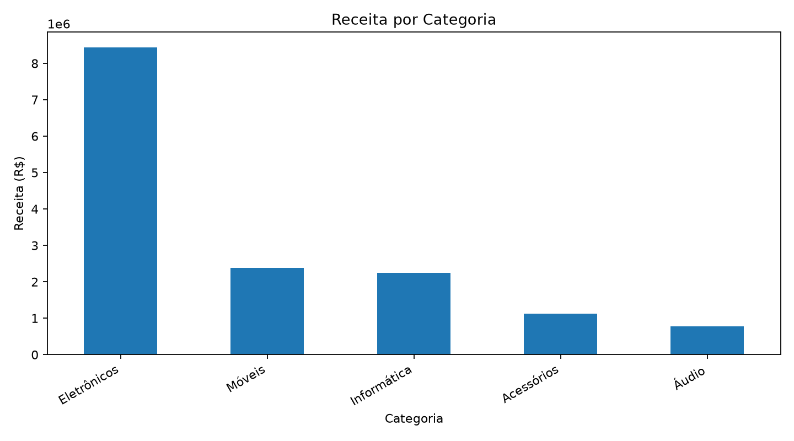
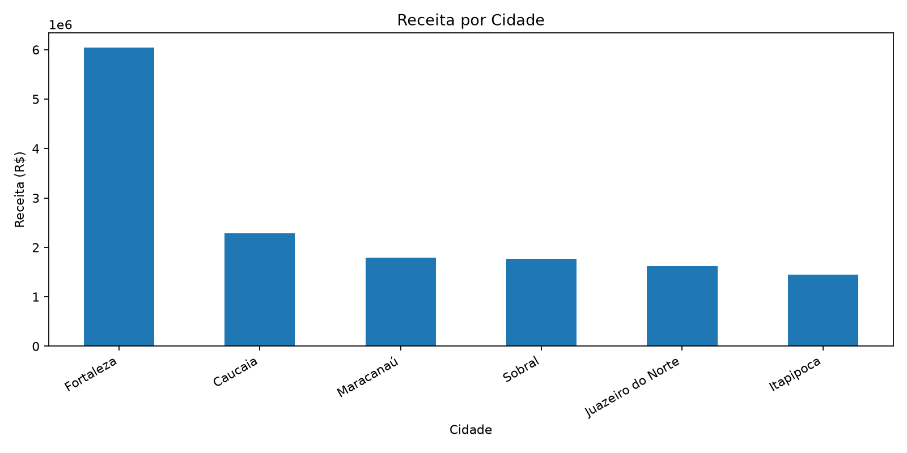

# 📊 Sales Data Analysis — Python

<p align="center">
  
  
  
  
  
  
</p>

Projeto de **análise exploratória de dados de vendas**, desenvolvido em Python para transformar dados brutos em informações úteis para tomada de decisão.

O projeto simula um cenário comercial no qual são analisadas vendas de diferentes produtos, categorias e cidades, permitindo identificar padrões de faturamento e desempenho.

O objetivo principal é demonstrar habilidades práticas em **Python, Pandas, análise de dados, visualização, indicadores de negócio (KPIs) e geração automatizada de relatórios**.

---

## 🎯 Objetivo

Analisar uma base fictícia de vendas para responder perguntas de negócio como:

- Qual é o faturamento total?
- Qual é o ticket médio das vendas?
- Quais produtos geram mais receita?
- Quais categorias apresentam maior faturamento?
- Quais cidades possuem melhor desempenho?
- Quais produtos possuem maior relevância comercial?

---

## 🛠️ Tecnologias utilizadas

| Tecnologia | Aplicação |
|---|---|
| 🐍 Python | Processamento e análise |
| 🐼 Pandas | Manipulação e tratamento dos dados |
| 📊 Matplotlib | Visualização dos resultados |
| 📄 CSV | Armazenamento da base de vendas |
| 🔀 Git | Controle de versão |
| 🐙 GitHub | Versionamento e portfólio |

---

## 📋 Indicadores analisados

O projeto calcula automaticamente:

- 💰 Faturamento total
- 🎫 Ticket médio
- 🧾 Quantidade de pedidos
- 🏆 Produtos com maior faturamento
- 📦 Quantidade vendida por produto
- 🟡 Receita por categoria
- 🌎 Receita por cidade

---

## 📁 Estrutura do projeto

```text
sales-data-analysis/
│
├── data/
│   └── sales.csv
│
├── graficos/
│   ├── top_produtos.png
│   ├── receita_por_categoria.png
│   └── receita_por_cidade.png
│
├── saida/
│
├── analysis.py
├── requirements.txt
├── README.md
└── LICENSE
```

---

# 📈 Principais resultados

A execução da análise apresentou os seguintes indicadores:

| Indicador | Resultado |
|---|---:|
| 💰 Faturamento total | **R$ 98.395,00** |
| 🎫 Ticket médio | **R$ 1.639,92** |
| 🧾 Pedidos analisados | **60** |
| 🏆 Produto líder em receita | **Notebook** |
| 💵 Receita com notebooks | **R$ 60.800,00** |
| 📦 Notebooks vendidos | **19** |

---

## 🏆 Produtos com maior faturamento

A análise mostra forte concentração da receita em determinados produtos.



O **Notebook** apresenta o maior impacto financeiro na base analisada, seguido pelo **Monitor**.

Essa informação permite identificar quais produtos possuem maior relevância para o desempenho comercial.

---

## 🟡 Receita por categoria



A análise por categoria permite visualizar quais segmentos concentram maior valor de vendas.

Esse tipo de indicador pode auxiliar decisões relacionadas a:

- planejamento comercial;
- gerenciamento de estoque;
- definição de campanhas;
- priorização de categorias;
- acompanhamento de desempenho.

---

## 🌎 Receita por cidade



A distribuição geográfica da receita permite comparar o desempenho das vendas entre diferentes localidades.

Essa análise pode ajudar na identificação de mercados com maior participação no faturamento e possíveis oportunidades comerciais.

---

# 💡 Insights de negócio

A análise revelou uma **forte concentração do faturamento em produtos eletrônicos**, principalmente notebooks.

Os notebooks geraram aproximadamente:

**R$ 60.800 / R$ 98.395 ≈ 61,8% do faturamento total.**

Isso significa que um único produto representa mais da metade de toda a receita da base analisada.

### 🔎 Interpretação

A concentração demonstra que notebooks possuem grande importância para o resultado comercial.

Ao mesmo tempo, uma dependência elevada de um único produto pode representar um risco para o negócio caso ocorram:

- queda na demanda;
- problemas de estoque;
- aumento de custos;
- redução da margem;
- entrada de novos concorrentes.

### 📌 Possíveis decisões

Com base nos dados, uma empresa poderia:

- garantir níveis adequados de estoque dos produtos de maior faturamento;
- acompanhar frequentemente a disponibilidade de notebooks;
- analisar margem e rentabilidade dos produtos líderes;
- criar estratégias para aumentar as vendas de produtos complementares;
- identificar oportunidades de crescimento nas categorias com menor participação;
- analisar diferenças de desempenho entre cidades.

---

# 📊 Fluxo da análise

O processo desenvolvido segue as principais etapas de uma análise de dados:

```text
Base CSV
   ↓
Carregamento dos dados
   ↓
Tratamento com Pandas
   ↓
Cálculo da receita
   ↓
Cálculo dos KPIs
   ↓
Agrupamento dos dados
   ↓
Análise por produto
   ↓
Análise por categoria
   ↓
Análise por cidade
   ↓
Criação dos gráficos
   ↓
Geração dos resultados
   ↓
Insights para tomada de decisão
```

---

# 🧠 Competências demonstradas

Este projeto demonstra conhecimentos práticos em:

- manipulação e tratamento de dados com **Python e Pandas**;
- leitura e análise de arquivos CSV;
- criação e interpretação de **KPIs**;
- cálculo de faturamento;
- cálculo de ticket médio;
- análise de desempenho por produto;
- análise por categoria;
- análise geográfica;
- agrupamento de dados com `groupby`;
- ordenação e transformação de informações;
- visualização de dados com **Matplotlib**;
- geração automatizada de gráficos;
- geração de relatórios;
- organização de projetos de análise;
- controle de versão com **Git**;
- publicação de projetos no **GitHub**;
- interpretação de resultados para tomada de decisão.

---

# ▶️ Como executar o projeto

### 1. Clone o repositório

```bash
git clone https://github.com/kaua085/sales-data-analysis.git
```

### 2. Entre na pasta

```bash
cd sales-data-analysis
```

### 3. Instale as dependências

```bash
pip install -r requirements.txt
```

### 4. Execute a análise

```bash
python analysis.py
```

Após a execução, o programa calcula os indicadores automaticamente e gera os arquivos de saída e os gráficos da análise.

---

# 📂 Base de dados

A base utilizada neste projeto é **fictícia** e foi criada exclusivamente para fins de estudo e demonstração de competências em análise de dados.

Entre as informações analisadas estão:

- data da venda;
- produto;
- categoria;
- quantidade;
- preço unitário;
- cidade.

A receita é calculada através da relação:

```text
Receita = Quantidade × Preço Unitário
```

---

# 🚀 Possíveis evoluções

O projeto pode ser expandido futuramente com:

- dashboard interativo;
- Power BI;
- análise temporal de vendas;
- crescimento mensal;
- comparação entre períodos;
- margem de lucro;
- custos e rentabilidade;
- previsão de vendas;
- identificação de tendências;
- banco de dados SQL;
- automação de atualização dos indicadores.

---

# 🎓 Aprendizados

O desenvolvimento deste projeto permitiu aplicar conceitos de programação e análise de dados em um cenário próximo de uma situação comercial real.

Além do processamento técnico, o projeto trabalha uma habilidade importante para análise de dados: **transformar números em informações capazes de apoiar decisões de negócio**.

---

# 👨‍💻 Autor

**Kauã Rafael**

Projeto desenvolvido para estudo, prática e construção de portfólio profissional na área de **Dados e Tecnologia**.

---

⭐ Se este projeto foi útil como referência, considere deixar uma estrela no repositório.