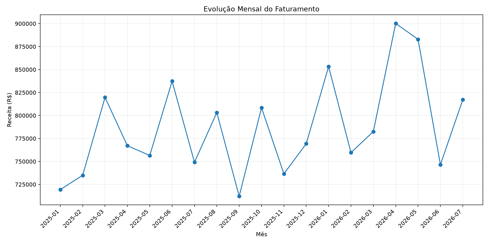
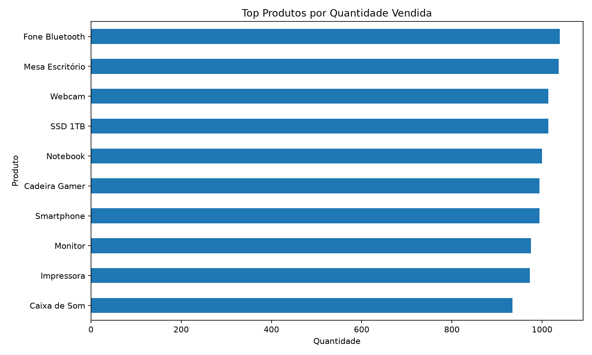

# 📊 Sales Data Analysis

<p align="center">
  
  
  
  
  
</p>

Projeto completo de **Análise de Dados de Vendas**, desenvolvido para transformar uma base comercial sintética em indicadores, análises, visualizações e um dashboard interativo.

O projeto utiliza uma base com **10.000 transações fictícias**, abrangendo produtos, categorias, cidades, regiões, canais de venda, formas de pagamento e descontos.

> **Nota:** todos os dados são sintéticos e foram criados exclusivamente para estudo e portfólio.

---

## 🚀 Dashboard Online

### [📊 Abrir Dashboard Interativo](https://kaua-sales-analytics.streamlit.app)

O dashboard permite explorar os resultados dinamicamente através de filtros.

---

## 🎯 Problema de negócio

O projeto busca responder perguntas como:

- Quanto a operação faturou?
- Qual é o ticket médio?
- Quais produtos geram mais receita?
- Quais produtos vendem mais unidades?
- Qual categoria apresenta maior faturamento?
- Quais cidades possuem melhor desempenho?
- Qual canal gera mais receita?
- Quais formas de pagamento são mais relevantes?
- Como o faturamento evolui mensalmente?
- Qual foi o crescimento entre os períodos?
- Quanto foi concedido em descontos?
- Existe concentração de receita em determinados produtos?

---

## 📊 Indicadores

O projeto calcula automaticamente:

- 💰 Receita bruta
- 🏷️ Descontos concedidos
- 💵 Receita líquida
- 🎫 Ticket médio
- 🧾 Pedidos
- 📦 Itens vendidos
- 🏆 Produto líder
- 🏷️ Categoria líder
- 🌎 Cidade líder
- 🛒 Canal líder
- 📅 Melhor mês
- 📈 Crescimento mensal
- 📊 Participação dos produtos

---

## 🔎 Filtros do Dashboard

O usuário pode filtrar os dados por:

- Categoria
- Cidade
- Produto
- Canal de venda
- Forma de pagamento
- Período

Todos os indicadores e gráficos são recalculados automaticamente.

---

## 🛠️ Tecnologias

| Tecnologia | Aplicação |
|---|---|
| Python | Programação e automação |
| Pandas | Manipulação e análise |
| Matplotlib | Gráficos estáticos |
| Plotly | Visualizações interativas |
| Streamlit | Dashboard |
| CSV | Base de dados |
| Git | Versionamento |
| GitHub | Portfólio e código-fonte |

---

## 📁 Estrutura

```text
sales-data-analysis/
│
├── data/
│   └── sales.csv
│
├── graficos/
│   ├── top_produtos.png
│   ├── receita_por_categoria.png
│   ├── receita_por_cidade.png
│   ├── evolucao_mensal.png
│   └── quantidade_por_produto.png
│
├── saida/
│   ├── resumo_kpis.csv
│   ├── ranking_produtos.csv
│   ├── receita_categorias.csv
│   ├── receita_cidades.csv
│   ├── receita_regioes.csv
│   ├── receita_canais.csv
│   ├── formas_pagamento.csv
│   ├── evolucao_mensal.csv
│   └── resultado.txt
│
├── generate_data.py
├── analysis.py
├── dashboard.py
├── requirements.txt
├── .gitignore
├── README.md
└── LICENSE
```

---

# 📈 Análises

## 🏆 Produtos por faturamento


Permite identificar os produtos que possuem maior impacto financeiro na operação.

---

## 🏷️ Receita por categoria


Permite comparar a participação das diferentes categorias no faturamento.

---

## 🌎 Receita por cidade


Permite avaliar diferenças de desempenho entre mercados geográficos.

---

## 📈 Evolução mensal



A análise temporal permite identificar oscilações, crescimento e períodos de maior faturamento.

---

## 📦 Quantidade vendida



Permite diferenciar produtos líderes em receita daqueles líderes em volume.

---

# 💡 Aplicação de negócio

Os indicadores podem apoiar decisões relacionadas a:

- planejamento de estoque;
- acompanhamento de produtos estratégicos;
- análise do mix de produtos;
- campanhas comerciais;
- estratégia de descontos;
- desempenho regional;
- canais de venda;
- comportamento temporal;
- planejamento comercial.

---

# 🔄 Pipeline

```text
Geração da base sintética
        ↓
CSV
        ↓
Carregamento com Pandas
        ↓
Limpeza e validação
        ↓
Engenharia de atributos
        ↓
Receita bruta
        ↓
Descontos
        ↓
Receita líquida
        ↓
KPIs
        ↓
Agrupamentos
        ↓
Análise temporal
        ↓
Rankings
        ↓
Gráficos
        ↓
Relatórios CSV/TXT
        ↓
Dashboard Streamlit
        ↓
Insights para tomada de decisão
```

---

# 🧠 Competências demonstradas

- Python
- Pandas
- limpeza de dados
- transformação de dados
- engenharia de atributos
- análise exploratória
- `groupby` e agregações
- KPIs comerciais
- análise temporal
- crescimento percentual
- análise de produtos
- análise por categoria
- análise geográfica
- análise de canais
- análise de descontos
- Matplotlib
- Plotly
- Streamlit
- dashboards interativos
- filtros dinâmicos
- exportação de dados
- Git
- GitHub
- deploy de aplicação

---

# ▶️ Como executar

Clone:

```bash
git clone https://github.com/kaua085/sales-data-analysis.git
```

Entre no projeto:

```bash
cd sales-data-analysis
```

Instale:

```bash
pip install -r requirements.txt
```

Caso queira recriar a base:

```bash
python generate_data.py
```

Execute a análise:

```bash
python analysis.py
```

Execute o dashboard:

```bash
streamlit run dashboard.py
```

---

# 📂 Dados

A base contém **10.000 transações sintéticas** e foi criada exclusivamente para fins educacionais e demonstração de competências.

Nenhuma informação representa vendas ou clientes reais.

---

# 👨‍💻 Autor

**Kauã Rafael**

Projeto desenvolvido para construção de portfólio profissional em **Análise de Dados e Tecnologia**.

### 🔗 Projeto online

[📊 Acessar Sales Analytics Dashboard](https://kaua-sales-analytics.streamlit.app)

---

⭐ Se este projeto foi útil como referência, considere deixar uma estrela.